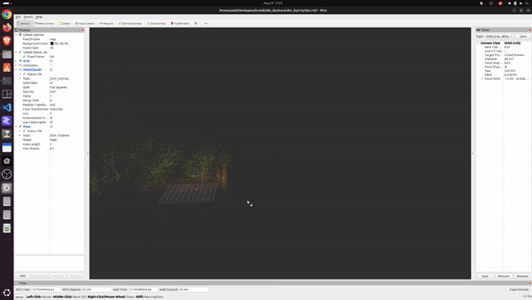

# SLIM LIO

Slim LIO is implemented in C++ using ROS2, Eigen, Sophus, and nanoflann for real-time LiDAR-inertial state estimation. The system performs tightly-coupled state estimation using an Iterated Error-State Kalman Filter (IEKF) with point-to-plane LiDAR registration and IMU preintegration.

It is a minimalistic yet effective implementation, designed to keep the codebase simple, readable, and focused while still providing robust LiDAR-inertial odometry performance.

The project focuses on efficient real-time odometry by combining:

* IMU-based motion propagation
* Point-to-plane scan matching
* Voxel-based local map representation
* Robust correspondence filtering
* Manifold-aware state optimization on SE(3)

The implementation is designed to be modular, fast, and easy to understand for research and educational purposes.

## Build

```bash
cd ~/Workspace
colcon build --symlink-install --cmake-args -DCMAKE_BUILD_TYPE=Release
source install/setup.bash
```
## Play rosbag
```bash
ros2 bag play ~/ros2bags/Occlusion04_ros2/Occlusion04_ros2_0.db3
```

## Run slim_lio Node

```bash
ros2 launch slim_lio lio.launch.py
```

